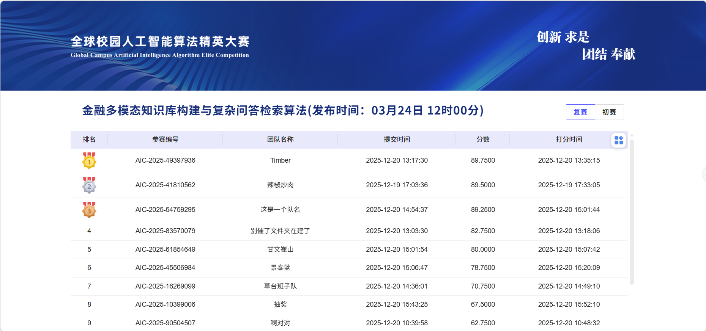

# 🏦 FinRAG: Enterprise-Grade Multimodal RAG Pipeline for Finance

[]()
[](./Timber-总决赛-郑诗籍-FinRAG.pdf)
[]()
[]()
[](https://opensource.org/licenses/MIT)

> 🏆 **1st Place Solution @ 2025 AIC.** > 
> FinRAG is an enterprise-grade multimodal Retrieval-Augmented Generation (RAG) pipeline for finance, featuring unified HTML parsing, dual-path BM25s retrieval, and dual-stage MoE generation.

<p align="center">
  
</p>

---

## 📊 Read the Presentation

For a deep dive into our system architecture, Multi-Agent evaluation methodology, and comprehensive performance engineering, please refer to our official slide deck:

👉 **[Download / View the FinRAG Presentation (PDF)](./FinRAGV1224.pdf)**

---

## 📖 The Challenge & Our Solution

Financial knowledge bases are core enterprise assets, but they are highly complex—spanning PDFs, Excel audit reports, Word manuals, and process flowcharts. Traditional retrieval methods fail due to information overload, high latency, and severe LLM hallucination risks.

**FinRAG** solves this by providing a highly accurate, blazing-fast, and fully traceable system. It abandons the expensive model fine-tuning route, offering a "plug-and-play" architecture that combines deterministic retrieval with generative reasoning.

## 🧠 System Architecture: The 5 Pillars

Our end-to-end pipeline is designed to conquer the "Accuracy vs. Latency" tradeoff:

### 1. Unified Multimodal Parsing (From Chaos to Structured Knowledge)
* **MinerU Integration:** Converts diverse document formats (PDF, Word, Excel, PPT) into unified, structured HTML.
* **Image-to-Knowledge:** Utilizes an OCR + VLM pipeline to translate unsearchable charts and flowcharts into semantic descriptions, boosting visual data utilization from **<10% to >90%**.
* **Path-Peeling Chunking:** Ensures chunk boundaries remain stable regardless of file storage paths.

### 2. Dual-Path Sparse Retrieval (Precision Recall)
* **Content Match (Path 1):** Global semantic retrieval across the entire knowledge base.
* **Topic Match (Path 2):** Structural retrieval focusing on file metadata/paths to capture strong topical relevance.

### 3. Dynamic Routing & LLM Reranking
* **Metadata-Driven Routing:** Dynamically selects between "Global Retrieval" (for cross-document analysis) and "Scoped Retrieval" (hard-filtering for single-document deep dives).
* **Deep Semantic Reranking:** Employs `bge-reranker-v2-minicpm` with **Dynamic Early Exit** (exiting calculation early based on similarity thresholds) to minimize computation waste.

### 4. Dual-Stage MoE Generation (Overcoming Attention Dilution)
* Powered by the **Qwen3-30B-A3B** Mixture-of-Experts (MoE) model.
* **Stage 1 (Summarize):** Generates a preliminary answer using the Top 6 chunks to ensure comprehensive coverage.
* **Stage 2 (Reinforce):** Feeds the preliminary answer alongside the Top 1 chunk back to the LLM to reinforce core evidence and eliminate attention dilution.

### 5. Full-Link Performance Engineering
* **Cross-Stage Pipelining:** Overlaps retrieval, reranking, and generation tasks asynchronously across queries.
* **BM25s Matrix Acceleration:** Upgrades traditional BM25 to sparse matrix operations.
* **Extractive Context Compression:** Reduces input tokens seamlessly via BM25-scored sentence extraction.

---

## 🚀 Key Performance Highlights

Our full-link engineering transformed the system from a prototype into a production-ready enterprise solution.

| Optimization Module | Baseline / Traditional | FinRAG Optimized | Improvement |
| :--- | :--- | :--- | :--- |
| **Retrieval Accuracy** | 79.55% (Single-path) | **93.73%** (Dual-path) | **+14.18%** |
| **Generation Accuracy** | 93.11% (Single-stage) | **96.65%** (Dual-stage) | **+3.54%** |
| **Sparse Retrieval Speed** | 37s (Rank-BM25) | **0.2s** (BM25s) | **185x Speedup** |
| **End-to-End Latency** | 31s (Serial processing) | **~5s** (Pipelined) | **6x Throughput** |

*Note: Factual accuracy was rigorously evaluated using a custom Multi-Agent Pipeline (Generator, Extractor, Auditor) calculating strict Keyword Recall Rates.*

---

## ⚙️ Quick Start & Reproducibility

**1. Clone the repository and install dependencies:**
```bash
git clone [https://github.com/](https://github.com/)[Your-Username]/FinRAG.git
cd FinRAG
pip install -r requirements.txt
```

**2. Start the services:**
*(Please refer to the source directories for specific execution scripts regarding MinerU preprocessing, BM25s indexing, and the Ollama model server).*

```bash
# Example: Run the RAG pipeline
python src/main.py --config configs/origin.yaml
```

---

## 🤝 Acknowledgements
Special thanks to the organizers of the **2025 AIC** and our team members at **Timber** for making this champion solution possible.
```

